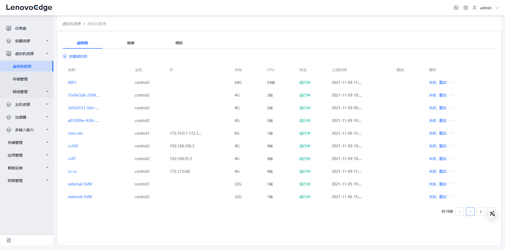
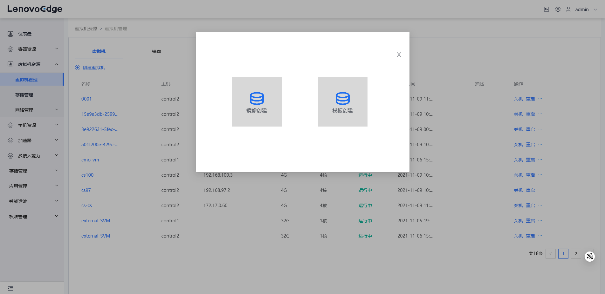
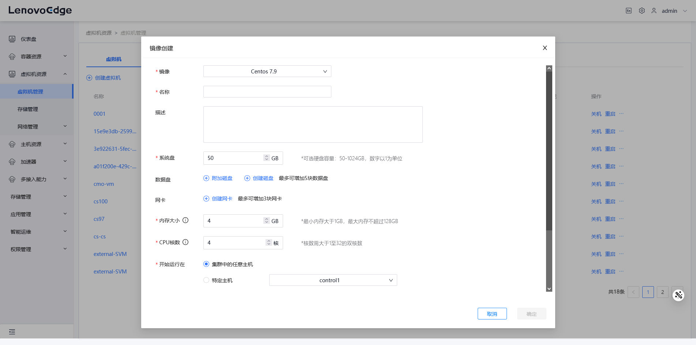
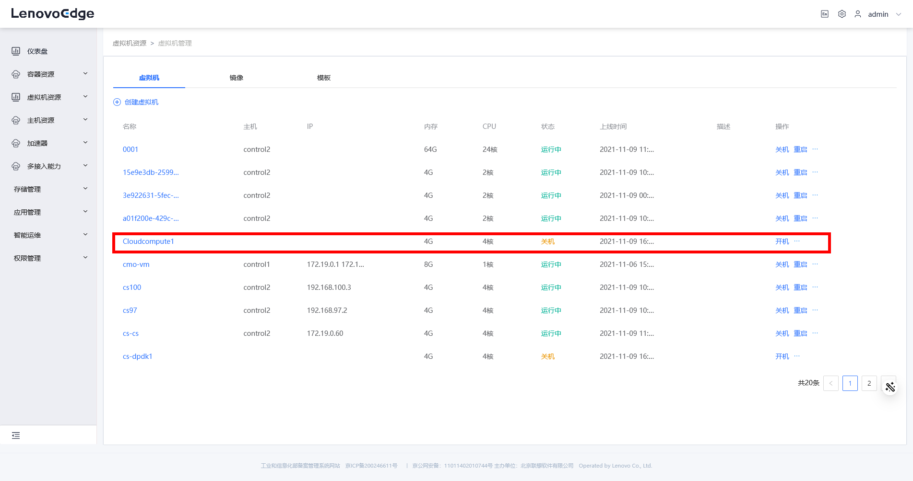
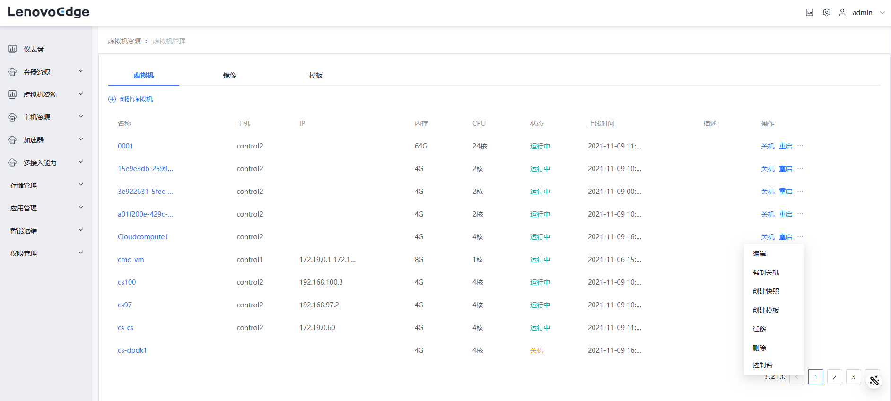
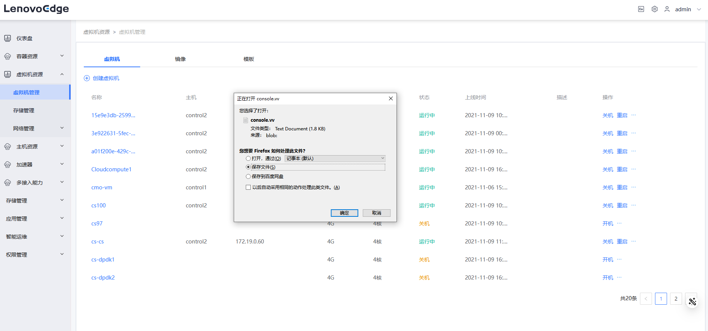
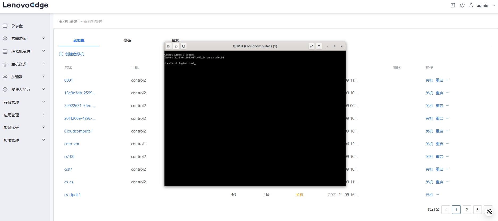

# LECP边端创建虚拟机

* TOC {:toc}

### 摘要

边端创建虚拟机资源

### 步骤

#### 打开虚拟机管理页面

#### 点击创建虚拟机按钮

#### 点击镜像创建，输入信息

\
\*虚机镜像上传

#### 虚拟机创建完成，处于关机状态

#### 虚拟机开机，点击控制台

#### 虚拟机控制台文件下载

#### 点击控制台文件，进入虚拟机

